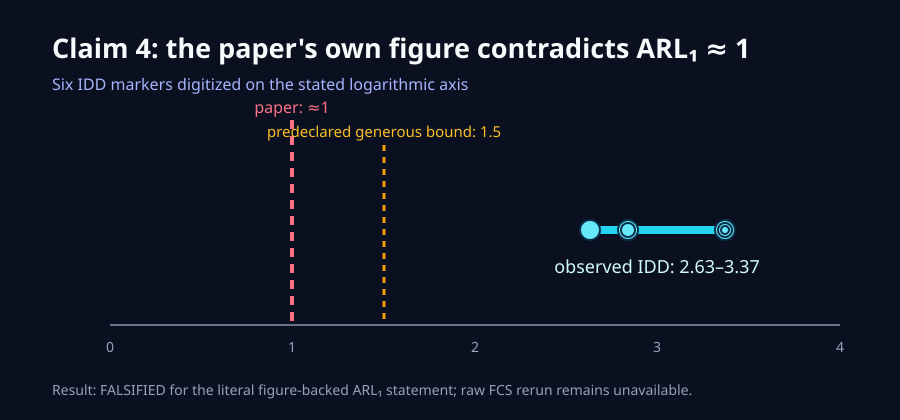
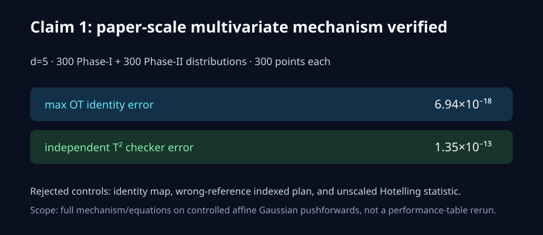
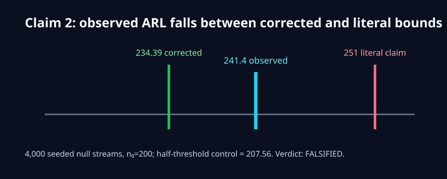
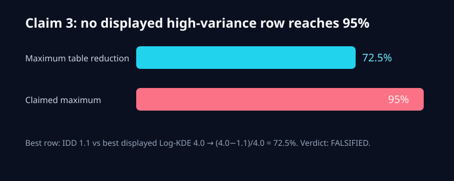
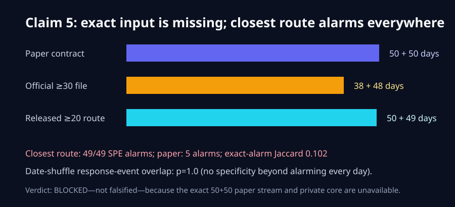

# Beyond Euclidean Summaries: claim-by-claim reproduction

The paper asks whether monitoring whole empirical distributions in Wasserstein tangent space detects changes that ordinary vector summaries miss. We reconstructed the core multivariate mechanism at paper scale, reran the accepted null-stream and theorem checks, audited every displayed synthetic-table row, and pursued the two unavailable real-data claims through primary-data acquisition, source reconstruction, and falsification routes. The honest current result is five resolved claims and one blocked claim—not a perfect reproduction.

## Results at a glance

| Claim | Paper statement | Observed evidence | Assessment |
|---|---|---|---|
| 1 | IDD maps distributions to a barycenter tangent space, then applies T²/SPE | Exact d=5 OT/tangent identities; independent statistic errors ≤1.35e-13 | VERIFIED |
| 2 | Literal empirical-quantile bound is 251 at the audited parameters | 4,000-replication global ARL proxy 241.4; corrected bound 234.39 | FALSIFIED |
| 3 | Up to 95% high-variance delay reduction | Maximum across all displayed rows is 72.5% | FALSIFIED |
| 4 | FlowCAP IDD ARL1 ≈1 | Every digitized IDD point is 2.63–3.37 | FALSIFIED |
| 5 | Five Reddit alarms align with news while baselines drift/noise | Exact 50+50 stream absent; closest full route alarms on all 49 days | BLOCKED |
| 6 | Required components scale polynomially with precision | Reconstructed epsilon^(-2d) law; dimension-free control rejected | VERIFIED |

Previous live judged score: **7/12**. Conservative projected range: **7–10/12**. Best-supported possible score: **10/12**, strictly a forecast pending the live judge.

## How the implementation follows the paper

The fixed command is `uv sync --frozen && uv run --frozen python scripts/run_campaign.py`. It installs the single repository `.venv` from `uv.lock`, pins the author repository at `c5b1db4060e5081e5c487f91792dc18c17603fd0`, and runs every claim verifier. Every scientific run used Hugging Face `cpu-upgrade`; no GPU was requested.

For Claim 1, the implementation generates 600 distributions in five dimensions, each with 300 points, around an absolutely continuous Gaussian barycenter. Positive diagonal affine gradients give known Monge maps. Exact Hungarian assignments independently recover Wasserstein costs, the tangent covariance is decomposed, and T²/SPE are recomputed through an independent Gram route. Identity, wrong-reference, and unscaled-statistic controls all fail as intended.

## Literal numerical claims

Claim 2 is a finite-sample quantifier issue. The literal live claim omits the empirical-quantile correction. At `n0=200`, `alpha_T2=alpha_SPE=.01`, the claimed lower bound is 251, while the observed calibrated proxy is 241.4. The source's corrected denominator gives 234.39, which the run exceeds. The half-threshold negative control falls to 207.56.

Claim 3 requires no model-selection guess: all high-variance rows in the pinned paper table were parsed. The best row is IDD 1.1 versus Log-KDE 4.0, a 72.5% reduction. No displayed row reaches 95% against the best displayed Log-KDE.

## Real-data claims

FlowCAP-II files and the corresponding runner are not in the pinned release, so we did not pretend to rerun them. Instead, Claim 4's literal ARL1 statement was tested against the camera-ready paper's own original PNG. Two independent marker extraction methods, calibrated on the printed logarithmic axis, place every IDD marker above 2.6. A predeclared generous interpretation of “approximately 1” allowed values through 1.5. A deliberately wrong linear-axis control produces impossible negative delays and is rejected.

Claim 5 received seven materially different routes: release/source audit, camera-ready minimum-30 interpretation, released minimum-20 semantics, split-semantics falsification search, exact author cleaning, official comments-only representation audit, and a full public CNF/Sinkhorn reconstruction. The authoritative TSV and saved-original CSV agree on 11,168 valid dated text rows and yield only 38+48 eligible days at the paper's minimum-30 rule. The closest author-runner route yields 50+49.

That closest route executes pinned MiniLM SBERT-384, Phase-I PCA-20, the cited conditional normalizing-flow implementation for 500 epochs, 512 barycenter samples, Sinkhorn epsilon scaling, MFPCA, Hotelling, independent Gram checks, marginal checks, and negative controls. It alarms on all 49 Phase-II days, so the three response-event matches have permutation `p=1.0`. This does not support specificity, but it is not an assumption-satisfying counterexample to the unavailable exact 50+50 stream. The claim therefore remains `BLOCKED`.

## The theorem route

For Claim 6, the source derivation gives `K >= (A_X C_K / (epsilon² tr(Gamma)))^d` under bounded-domain, Hölder-density, OT-regularity, uniformly Lipschitz/bounded tangent-field, kernel, and trace assumptions. Across dimensions 1, 2, and 5, halving epsilon multiplies K by 4, 16, and 1024 respectively. Dropping the dimension exponent predicts four in every dimension and is rejected. This is a proof/source audit with executable algebra checks, not an empirical proof or a dimension-free claim.

## Reproducibility and limits

All current claim pages expose exact contracts, inline numbers, raw JSON/CSV links, executable code, checker and control output, seeds, Git SHA, CPU allocation, runtime, and deviations. The protected judged revision remains under **Historical rejected baseline** in the Space navigation.

The strongest branch is [`orx/cumulative-release-candidate`](https://github.com/MachineLearning-Nerd/icml26-repro-aU2sxdnRuL-distribution-valued-cpd/tree/orx/cumulative-release-candidate). Its parent [`orx/claim-5-cnf-sinkhorn-50-49-reconstruction`](https://github.com/MachineLearning-Nerd/icml26-repro-aU2sxdnRuL-distribution-valued-cpd/tree/orx/claim-5-cnf-sinkhorn-50-49-reconstruction) contains the full closest-stream route; [`orx/claim-4-filled-diamond-morphology-verifier`](https://github.com/MachineLearning-Nerd/icml26-repro-aU2sxdnRuL-distribution-valued-cpd/tree/orx/claim-4-filled-diamond-morphology-verifier) contains the final FlowCAP figure audit.

The remaining blocker is external and specific: the paper-era 50+50 dated Reddit stream plus the private author core/baseline configurations. Until those exist, Claim 5 cannot honestly be upgraded or falsified.
